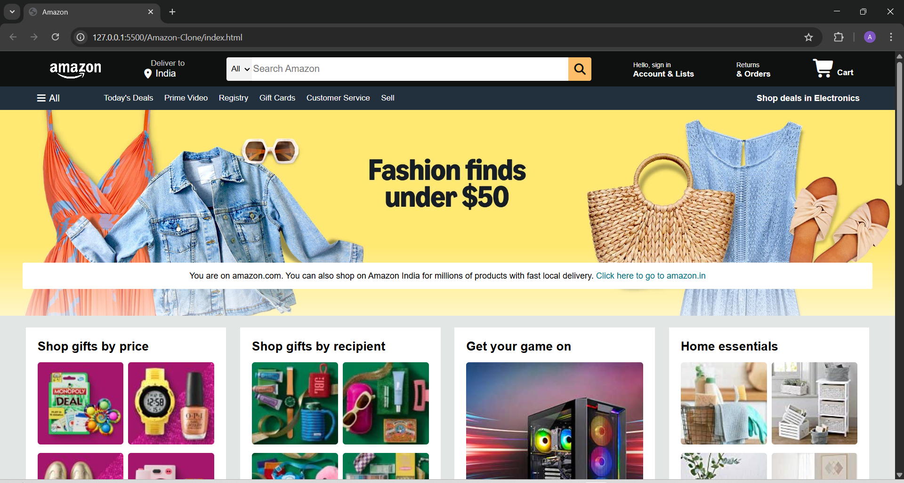
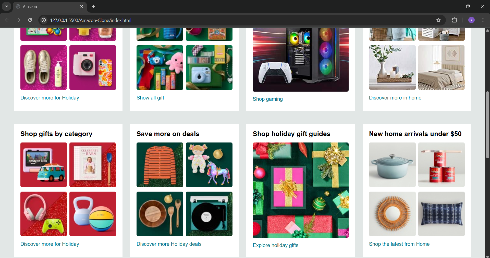
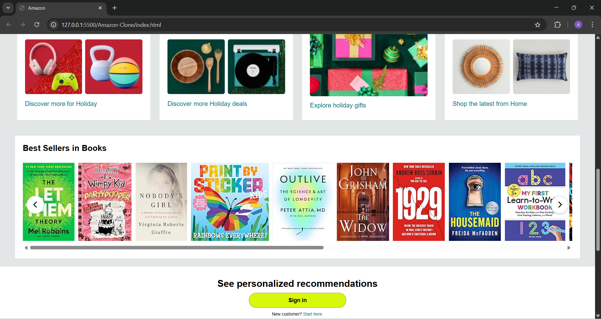
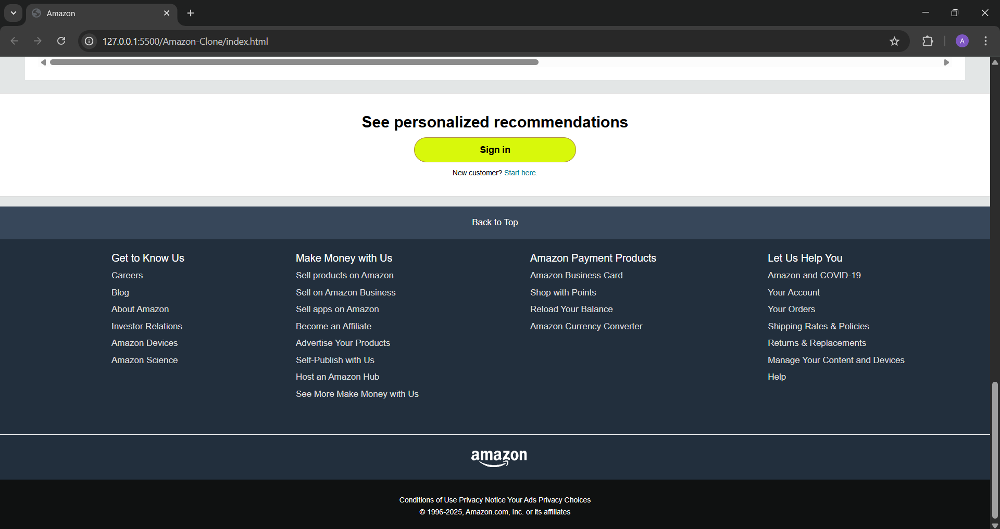

# 🚀 Amazon Homepage Clone

A responsive **Amazon-inspired homepage clone** built using **HTML, CSS, and JavaScript**.  
This project is part of my frontend development journey to practice UI design, layout structuring, and JavaScript interactivity.

---

## 🔗 Live Demo
👉 https://amazon-clone-gamma-rust.vercel.app/

---

## 📸 Screenshots

### 🏠 Home Page

### 🧩 Sections Layout

### 🎯 Hero Slider

### 🦶 Footer

---

## 🛠️ Tech Stack

- HTML5  
- CSS3  
- JavaScript (Vanilla JS)

---

## ✨ Features

- Responsive Amazon-like homepage UI  
- Fully structured navigation bar  
- Product grid sections similar to e-commerce sites  
- Hero image slider with smooth JavaScript scrolling  
- Auto-scroll book/product slider with pause on hover  
- Clean and modern UI design  
- Responsive layout for mobile, tablet, and desktop  

---

## 📚 What I Learned

- How real-world e-commerce websites are structured  
- Advanced CSS (Flexbox, Grid, positioning, animations)  
- Responsive design for multiple screen sizes  
- DOM manipulation using JavaScript  
- Creating auto-scroll and interactive sliders  
- UI polishing using hover effects and transitions  

---

## 🚀 Future Improvements

- 🛒 Add shopping cart functionality  
- 🔍 Add search feature  
- 📄 Create product detail pages  
- 📱 Improve mobile responsiveness further  
- ⚙️ Add backend integration in future version  

---

## 👨‍💻 Author

**Aditya Kumar Jha**  
Frontend Developer 🚀 | Learning & Building in Public

---

## 📌 Tags

`HTML` `CSS` `JavaScript` `Frontend Development` `Amazon Clone` `UI Design` `Web Development`